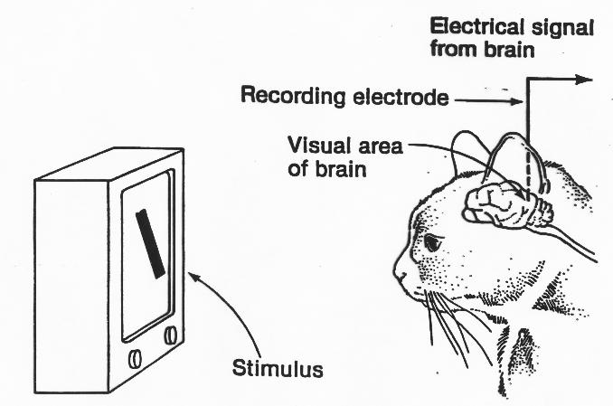
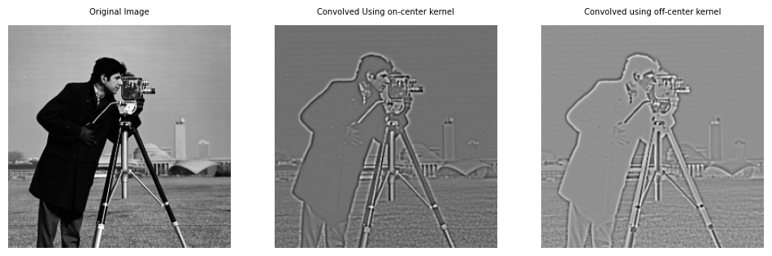
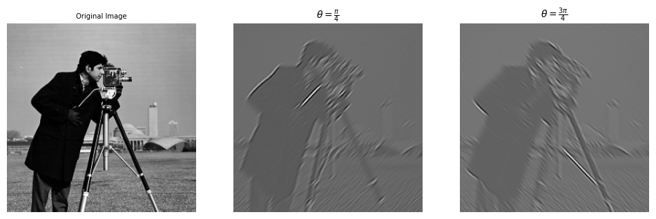
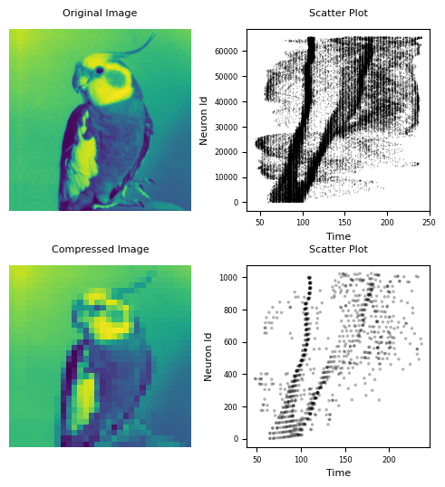
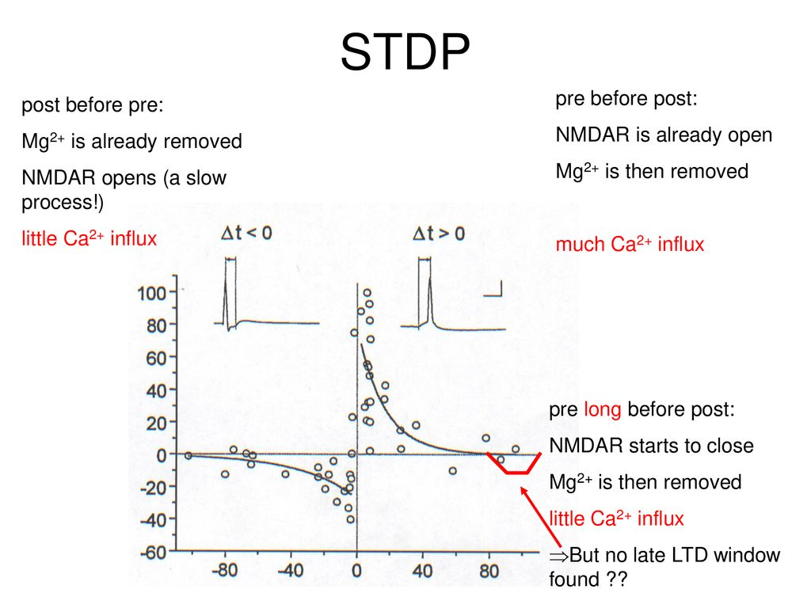

# Processing in Primary Visual Cortex and Interlayer Communication in Spiking Neural Networks

<p align="center">
  
</p>

This project focuses on simulating image processing mechanisms inspired by the **primary visual cortex (V1)** and investigating **interlayer communication** in **Spiking Neural Networks (SNNs)**. The project implements filters like **Difference of Gaussians (DoG)** and **Gabor filters** to simulate the functionality of V1 neurons, and uses neural coding schemes such as **Time to First Spike (TTFS)** and **Poisson coding**. The **Spike-Timing-Dependent Plasticity (STDP)** learning rule is applied to enhance the learning process in SNNs.

## Table of Contents
- [Project Overview](#project-overview)
- [Implemented Features](#implemented-features)
- [How to Run](#how-to-run)
- [Results](#results)
- [References](#references)

## Project Overview
This project aims to simulate the functionality of visual cortex neurons through the application of **DoG** and **Gabor filters** on grayscale images, mimicking edge detection processes in biological vision systems. Furthermore, the project explores the encoding of visual information using **TTFS** and **Poisson coding**, and analyzes the performance of **spiking neural networks** with interlayer communication using the **STDP learning rule**.

## Implemented Features
1. **DoG Filter**:
   - Simulates on-center off-surround and off-center on-surround retinal receptive fields for edge detection.

<p align="center">
  
</p>

2. **Gabor Filter**:
   - Simulates simple cells in the primary visual cortex (V1), detecting edges at specific orientations and spatial frequencies.

<p align="center">
  
</p>

3. **Neural Coding**:
   - **Time to First Spike (TTFS)**: Encodes images based on the timing of neuron spikes.
   - **Poisson Coding**: Encodes images using Poisson-distributed spike times.

<p align="center">
  
</p>


4. **Spike-Timing-Dependent Plasticity (STDP)**:
   - STDP learning rule adjusts synaptic weights based on spike timing to optimize the SNN’s performance in recognizing visual patterns.

<p align="center">
  
</p>

## How to Run
1. Clone the repository:
   ```bash
   git clone https://github.com/MohaZamani/SNN-Visual-Cortex-Simulation.git
2. Install the necessary dependencies:
   ```bash
   pip install -r requirements.txt
3. Run the simulation notebooks:
   - **For DoG and Gabor Filters**: Open and run `Filters.ipynb`
   - **For SNN with STDP**: Open and run `SNN.ipynb`

   You can launch the notebooks by executing:
   ```bash
   jupyter notebook
## Results
Results from the simulations include:
- **Edge Detection**: Visualization of the effects of DoG and Gabor filters on input images, showing enhanced edge detection.
- **Spike Raster Plots**: Visualization of neural activity using TTFS and Poisson coding.
- **Weight Changes**: Visualization of synaptic weight adjustments using the STDP learning rule.

All simulation results and detailed analysis is provided in the [report](./Report/Report-P5.pdf).

## References
- **Gabor Filters**: [Gabor Filters in Visual Processing](https://en.wikipedia.org/wiki/Gabor_filter)
- **STDP Learning**: [Spike-Timing-Dependent Plasticity on Wikipedia](https://en.wikipedia.org/wiki/Spike-timing-dependent_plasticity)
- **Primary Visual Cortex (V1)**: [Visual Cortex Overview](https://en.wikipedia.org/wiki/Visual_cortex)

